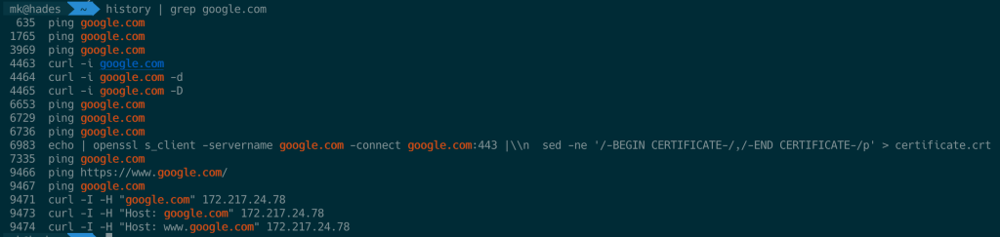
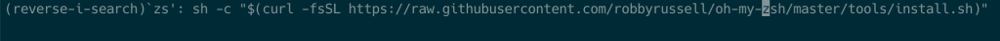
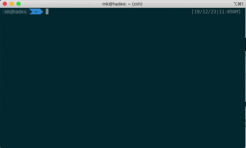
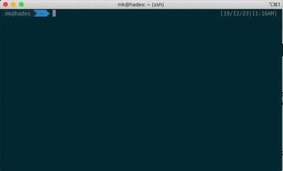

TIP 1: Search History Command
=============

Trong mấy năm thấy mọi người dùng nút up **↑** để mò lại những câu lệnh đã gõ. Ví dụ mình gõ ```lsof -i :22``` và sau đó
gõ 5 câu lệnh nữa, vậy là mình sẽ cần ấn nút up **↑** 5 lần. Nghe có vẻ mất thời gian và tay to và nhiều câu lệnh quá
dài hay khó nhớ.

Tình cơ thì Linux hay Mac đều lưu trữ lại câu lệnh mà mình đã gõ, có thể tìm thấy ở các file ```.history``` hay đơn giản
là gõ ```history```


Vậy là chúng ta có thể ```history | grep {batkicaigi}``` để tìm kiếm



Vậy vẫn hơi lâu, nếu ấn một nút để search thì sao, rất may cái nãy cũng được hỗ trợ luôn ```Ctrl + R``` và gõ thôi



Vấn đề nữa xảy ra, quá ít kết quả được hiển thị, khá là khó chịu.
Sau một hồi search thì phát hiện ra có nhiều thứ hỗ trợ mình trong đó có thằng
này: [peco](https://github.com/peco/peco), một tool filter được viết bằng Go Lang, chúng ta có thể truyền bất kì cái gì
vào trong ```pipe``` của câu lệnh, từ ```history```, ```ls```, text file hoặc bất kì cái gì.



Giờ hãy kết hợp history search (```Ctrl + R```) và ```peco```.

How to install
---------
```
$ brew install peco
...
$ peco --version
$ peco version v0.5.1
```
À đấy là MAC còn cái khác thì chịu khó đọc cái [này](https://github.com/peco/peco#installation).

Tiếp theo thì sửa cái ```.zshrc``` hoặc ```.bashrc```, tùy xem bạn dùng cái gì, đơn giản là sửa binding key cho phím ```Ctrl + R``` thôi.

```
# Peco history selection
function peco-history-selection() {
  local tac
  if which tac > /dev/null; then
    tac="tac"
  else
    tac="tail -r"
  fi
  BUFFER=$(history -1000 | eval $tac | cut -c 8- | peco --query "$LBUFFER")
  CURSOR=$#BUFFER
}
zle -N peco-history-selection
bindkey '^R' peco-history-selection
```
và reload lại
```
$ source .zshrc (or .bash_rc)
```
Thành quả nè



