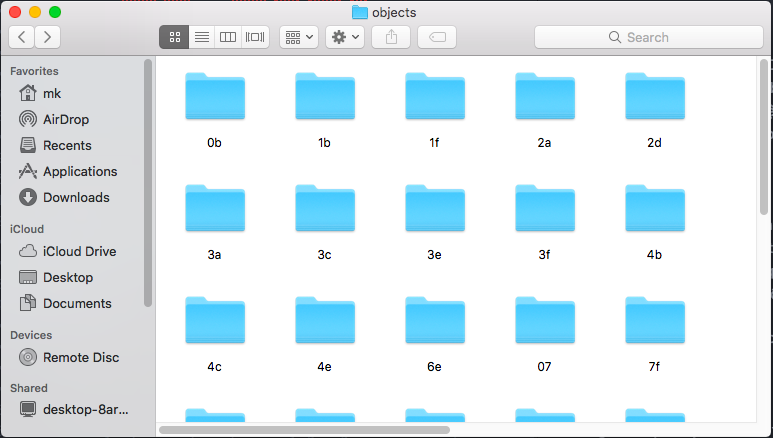
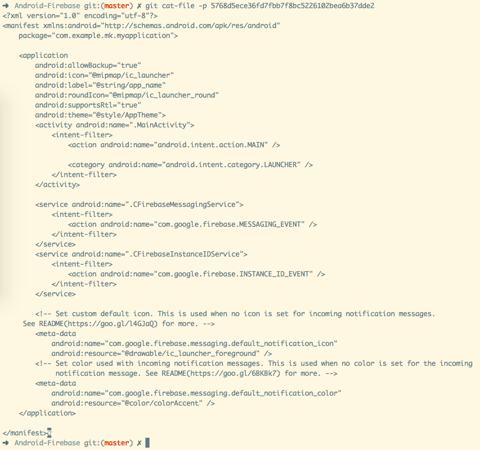

How to recover corrupted GIT repository
====

GIT corrupted, really?
-----

Thực sự vấn đề này mình cũng không sure lắm là do đâu, và cũng không chắc vấn đề này có phải là corrupted hay không nhưng sẽ note lại một chút về case này.

### Nạn nhân
Ngô Hải Đoàn, 1995, Android Dev. Anh ta đang làm việc trên PC, đột nhiên tòa nhà bị mất điện, khi bật máy lại anh ta phát hiện ra anh ta không thể thực hiện các câu lệnh git trên local-repository của mình nữa và mình là thằng cave được gọi support.

### Phán đoán
Trước khi vào phần phán đoán thì mình có hỏi về source code đã commit chưa, nếu commit rồi thì khả năng recover được rất cao.
Câu hỏi thứ 2, source code đó có quan trọng không, nếu có thể re-work trong dưới 30m thì chắc sẽ không có node này.

Mình sẽ kết thúc phần phán đoán ở đây vì chả có gì để phán đoán cả

### Kiểm tra một chút.
Trong khi voọc máy của Đoàn thì mình có cố re-init repository nhưng có vẻ không khả quan, kiểm tra một lúc thì có vẻ như các object và ref của git vẫn còn khá ổn. Bạn có thể tự kiểm tra thư mục `.git` trong local repository của mình.

> Như vậy, nhìn chung khả năng cao branch/commit quan trọng vẫn ổn.

### Thử recover.

Mình có sử dụng một số câu lệnh git cơ bản như `git log` hay `git init` để thử lấy lại commit-id nhưng không thành công.

Đến đây nhìn chung bạn không thể làm gì với repo này nữa, nên mình sẽ chuyển toàn bộ object của repo này sang một thư mục khác mà vừa clone về. (copy thư mục `object` trong `.git` của thư mục cũ sang chỗ tương ứng của thư mục mới)

> Đến đây bạn có một repository giống với remote (chỗ mà bạn clone về) và cộng thêm các commit mà bạn đã commit hoặc đã pull về từ remote.

### Tại sao lại copy `objects`

Nhìn chung nếu bạn đã commit thì không sợ mất content. Bởi khi commit git sẽ sinh ra các file `object` trong thư mục `objects`, công với log trong `logs` và một số `ref` hay `info`.

Object name sẽ dài 40 ký tự (SHA1)

Thư mục object của bạn sẽ trông như này

Tên thư mục sẽ là 2 ký tự đầu trong 40 ký tự.
Trong thư mục sẽ có các file với tên là 38 ký tự còn lại.

Objects sẽ chứa thông tin về file (changed content)
để xem được thì cần dùng câu lệnh git(do git mã hóa nên chỉ git xem đc :D): `git cat-file`

> Đến đấy các bạn sẽ đặt câu hỏi thế git quản lý các file thành commit như thế nào

Từ các `objects` thì git sẽ dựng lên tree là các phiên bản của thư mục bao gồm các `objects`.

Cứ thế, bằng cách duyệt tree, ta sẽ có 1 tree hoàn chỉnh gồm content của cả một phiên bản (commit).

Cuối cùng commit sẽ bao gồm 1 tree

> Tóm lại cứ còn objects là bạn còn tất cả, việc còn lại là đi tìm commit-id để recover.

### Tìm commit

Có một vài chỗ để bạn có thể tìm GIT commit-id, thứ nhất đó là thư mục `refs`

#### Refs

Refs chỉ đơn giản là references của commit. `Refs` dùng để bạn nhớ lastest commit bằng cách lưu commit id vào thư mục refs.

Ở đây lastest commit của nhánh master đang là **b94514784b0b86e84bdd2d66903de5bf7f9722c2**.

Vậy nhớ được tên nhánh là có thể recover lại được. Lúc này bạn sẽ recover toàn bộ tree của nhánh đó và mặc nhiên các commit base trên commit này sẽ có thể trace được.

#### logs

Một chỗ nữa, toàn năng hơn là `logs`. Log lưu lại lịch sử của từng nhánh.

Bạn có thể xem mình đã *tunglamgi* trên từng nhánh.

> Đến đây bạn có commit-id rồi việc còn lại là recover bằng câu lệnh `git checkout commit-id`

### Btw

Nhìn chung xử lý mấy việc lặt vặt này khá hay và tạo cho mình nhiều cơ hội xử lý các thủ thuật về **git**.

Anw: Dù mất kì chuyện gì xảy ra đừng bao giờ xóa thư mục **`.git`**
:D 
