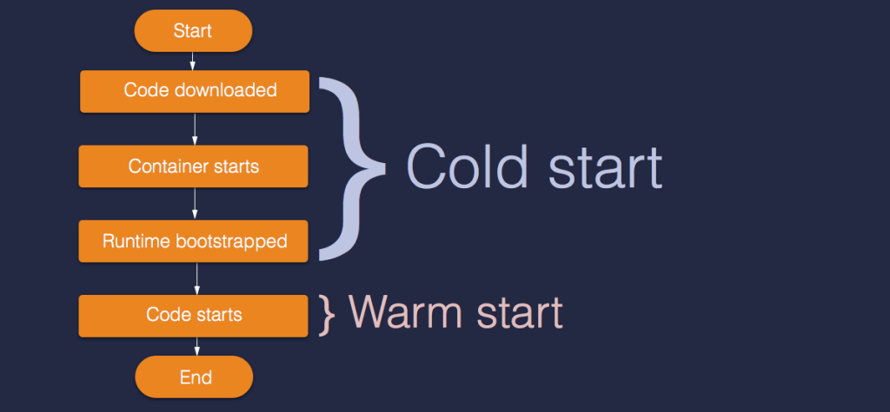
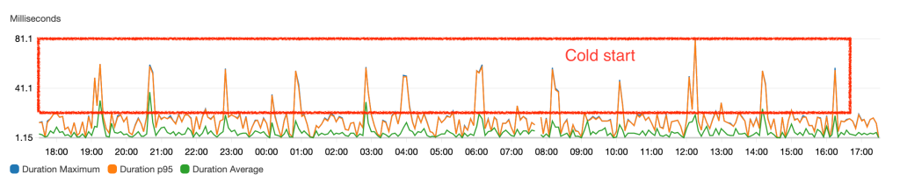

Gần đây có nghiên cứu lại mấy vấn đề của **[Lambda function](https://aws.amazon.com/lambda/)** và mày mò vào Node
Summit, bài viết này thực ra trình bày
lại [topic này](https://vimeo.com/287511222?fbclid=IwAR31W61fC-MJcXiPdT4ywMKX-ccKiAzviQogcOaivyGpPzcj5vY16A6obCw)
của [Matt Lavin
](https://www.linkedin.com/in/mdlavin/)

Về cơ bản với Lambda, [[AWS]] đã làm gần hết mọi thứ về management, scale function, kết nối đến các service như DynamoDB,
SQS,... Gần như chúng ta chỉ cần chú ý đến việc coding là chính. Tuy nhiên để mọi thứ tốt hơn cho người dùng thì cần
giảm latency, response nhanh hơn và dễ debug hơn trong những trường hợp cần thiết và chính trong source code Lambda
function tức là:

* Cải tiện latency
* Tìm ra bug performance
* Debug.

Bài này sẽ nói về các cách optimze coding là chính, những phần khác thì hãy xem kỹ topic nhé.

Đầu tiên bao giờ cũng cần tìm hiểu xem Lambda hoạt động như nào nhưng trước tiên mình sẽ đưa một ví dụ điển hình về
lambda function:

```nodejs
const dynamodb = require('aws-sdk/clients/dynamodb');
const docClient = new dynamodb.DocumentClient();
const tableName = process.env.SAMPLE_TABLE;
exports.getByIdHandler = async (event) => {
    const { httpMethod, path, pathParameters } = event;
    if (httpMethod !== 'GET') {
        throw new Error(`Unsupported method`);
    }
    console.log('received:', JSON.stringify(event));
    const { id } = pathParameters;
    const params = {
        TableName: tableName,
        Key: { id },
    };
    const { Item } = await docClient.get(params).promise();
    const response = {
        statusCode: 200,
        body: JSON.stringify(Item),
    };
    return response;
};
```

Khá là điển hình với việc: Khởi tạo SDK, handle request, query database và đưa ra kết quả, tất nhiên trước đó sẽ là
download source code và khởi chạy lambda function. Và hãy ghép nó vào mô hình lifecycle của lambda function như ở bên
dưới.



Như hình bên trên toàn bộ Lifecycle của AWS Lambda bao gồm *Cold Start* và *Warm Start*.
Warm start: bao gồm phần thời gian code chạy
Cold start: thời gian chuẩn bị.

Như vậy có thể thấy rằng phần warm start là phần coding đơn thuần và optimze như chúng ta optimze source code khi sử
dụng các framework hay runtime khác. Mặt khác, mọi người thường nghĩ rằng Lambda Function sẽ thực hiện toàn bộ các bước
trên mỗi lần execute nhưng không Lambda sẽ không khởi chạy lại *Cold Start*, miễn là bạn không update source code nhưng
chỉ trong 15 phút thôi nhưng vậy là quá đủ. Reduce latency sẽ bắt đầu từ đây.



Như hình trên cứ sau một khoảng thời gian nhất định Lambda function lại thực hiện Cold Start, những chỗ thời gian
execute cao bất thường ấy, nhìn chung hãy để function Lambda luôn sẵn sàng để execute.

Một cách chính thống hơn thì có thể tìm hiểu
ở [đây](https://docs.aws.amazon.com/lambda/latest/dg/running-lambda-code.html), AWS đề cập đến Lambda execution
context (Môi trường để running Lambda code), context này sẽ bị đóng băng sau khi sử dụng xong function và được giã đông
khi chạy lần tiếp và AWS cũng đề xuất một vài thủ thuật để optimize Lambda function:

* Đầu tiên bắt đầu với ***handler*** method, Các object được khai báo bên ngoài ***handler*** vẫn được khởi tạo, cung
  cấp tối ưu hóa bổ sung khi ***handler*** được gọi lại. Ví dụ: nếu Lambda connect đến database (RDS, DynamoDB), thay vì
  kết nối đi kết nối lại, kết nối được tái sử dụng qua các lần invoke khác nhau trong một lambda instance. Một cách đơn
  giản có thể lazy load connection, như bây giờ AWS đã cải tiến SDK để dùng keep alive hoặc đơn giản là chuyễn những thứ
  nặng nề ra khỏi ***handler***, cache lại AWS SDK Client

```
    const AWS = require('aws-sdk')
    // http or https
    const https = require('https');
    const agent = new https.Agent({
      keepAlive: true
    });
  
    const dynamodb = new AWS.DynamoDB({
      httpOptions: {
        agent
      }
    });
```

```
    fuction fuckingHeavyFunction() {
    }

    const outsideHeavyResult = fuckingHeavyFunction(); // run on every Lambda init instance.

    exports.handler = async (event) => {
      const heavyResult = fuckingHeavyFunction(); // run on every lambda request
      return response;
    };
 ```

* Mỗi Lambda function có 512Mb lưu trữ ở `/tmp`, bạn có thể lưu trữ bất kỳ thứ gì. Vùng lưu trữ này sẽ được đóng băng
  cùng với Execution context, như vậy bạn có thể lưu trữ nhiều thứ ở trong này, ví dụ những tính toán, variable ít thay
  đổi có thể lưu trữ lại và dùng lại cho lần tiếp theo.
* Nếu sử dụng background process trong Lambda function, hãy chắc chắn nó được hoàn toàn hoàn thành khi Lambda function
  kết thúc, vì có thể nó được sử dụng lại và tiếp tục chạy. Dẫn đến những bug không như ý.
  Nhưng nói chung cũng không nên nghĩ rằng Lambda sẽ sử dụng lại các tài nguyên khi chạy lại Lambda function, hãy chuẩn
  bị lại các tài nguyên hoặc kiểm tra việc sử dụng cho chắc chắn.
* Thực ra vấn đề cold start này cũng gặp phải ở các ngôn ngữ khác chạy trên Lambda function.