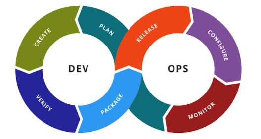

[[refs/DevOps]]

Nếu cắt đều những vòng lặp vô tận của toolchain thì chúng ta sẽ thấy cái nhìn cơ bản của pipeline.

| Plan | Create | Build | Verify | Package | Configure | Release | Verify | Monitor |
| ---- | ------ | ----- | ------ | ------- | --------- | ------- | ------ | ------- |

## Pipeline foundation

Gồm 2 bước: Plan, Create

### Planning with Agile project management tools

Để tracking tiến độ, xem chúng ta đang ở đâu từ request -> release.

### Viết code và tạo tài liệu

Version Control đóng vai trò quan trọng, ngày nay version control lưu trữ cả test script và tất cả những thứ liên quan đến thay đổi và release.

Document thì thường lưu trữ ở Wiki: requirements specifications, architectural  models, UI wireframes, and product and user documentation.

## [[refs/continuous_integration|Continuous integration]]

Gồm 3 bước: Build, Verify, Package

### Orchestrating the change.