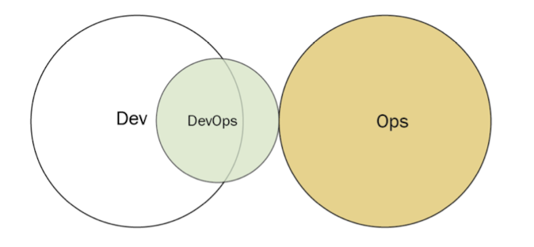

[[refs/DevOps]]

Khó có thể để xác định trách nhiệm nằm ở đâu khi chuyển sang phương pháp DevOps. Ai chịu trách nhiệm tạo ra quy trình [[refs/cicd|CI/CD]]? Chúng ta chọn database loại gì? Chúng ta deploy vào môi trường production như nào?

Năm 2013, Matthew Skelton mô tả ba loại nhóm chống đối cần tránh và năm cấu trúc nhóm có thể có. Những đóng góp bổ sung đã tăng số lượng loại chống đối lên tám và số lượng cấu trúc nhóm có lợi lên chín ([[https://web.devopstopologies.com/|refs]])

* Dev and Ops Silos
* Permanent DevOps Team Silo
* Dev Doesn’t Need Ops
* DevOps as the Dev Tools Team
* Rebranded Sysadmins
* Ops Embedded in Dev Team
* Dev and DBA Silos
* Fake SRE

Vậy nên sinh ra 9 loại DevOps Topology

Compare [[https://phoenixnap.com/blog/devops-maturity-model|DevOps Maturity Model]]

#### 1. Dev and Ops collaboration

Được coi là phương pháp DevOps lý tưởng, trong đó Dev và Ops làm việc cùng nhau và có sự cộng tác nhịp nhàng. Việc triển khai cấu trúc này có thể đòi hỏi một sự thay đổi lớn về văn hóa tổ chức theo hướng [[refs/ron_westrum_generative_culture|Generative Culture]]).

#### 2. Fully shared Ops responsibilities

Một vài tổ chức thì làm việc với một hoặc một vài sản phẩm web-based (Netflix, Facebook), có khả năng để áp dụng [[refs/devops_topology#dev-and-ops-collaboration|Dev and Ops collaboration]] và integrate Ops vào mọi quy trình.

Trong model này thì rất ít phân biệt giữa Dev và Ops

#### 3. Ops as IaaS

Có thể có một số tổ chức có bộ phận Ops truyền thống. Ngoài ra, một số tổ chức có thể triển khai ứng dụng vào môi trường public cloud như AWS hoặc Azure. Trong cả hai trường hợp, một nhóm nhỏ của Dev có thể coi operation là một dịch vụ và thiết lập công cụ để deploy, metrics, provisioning, monitoring các tài nguyên đó. Trong mô hình này, không có sự hợp tác trực tiếp với Ops.

#### 4. DevOps as an external service

Một số nhóm và tổ chức nhỏ hơn có thể không có đủ nhân lực hoặc kinh nghiệm để chuyển sang phương pháp DevOps. Trong trường hợp đó, họ có thể ký hợp đồng với một nhà cung cấp bên ngoài để tạo test environment và automation cũng như config monitoring. Các nhà cung cấp DevOps cũng có thể đào tạo Dev và Ops để chuyển sang một mô hình khác, chẳng hạn như [[refs/devops_topology#dev-and-ops-collaboration|Dev and Ops collaboration]].

#### 5. DevOps team (with expiration date)

Có thể có những tình huống mà việc có một nhóm DevOps chuyên dụng sẽ hiệu quả. Ý tưởng là nhóm DevOps có thể đóng vai trò là cầu nối cho cả nhóm Dev và Ops. Nhóm DevOps có thể hướng dẫn Dev cách làm việc với cơ sở hạ tầng và có thể hướng dẫn Ops về phát triển Agile. Đến một thời điểm nào đó, nhóm DevOps sẽ giải thể, cho phép Dev và Ops cộng tác trong mô hình cộng tác Dev và Ops. Sẽ tiềm ẩn nguy cơ nếu nhóm DevOps không giải thể, thay vào đó lại hình thành một silo riêng biệt. Trên thực tế, đây là một trong những loại anti-types (Silo nhóm DevOps) được đề cập ở trên.

#### 6. Nhóm ủng hộ DevOps - DevOps advocacy team
Nhóm ủng hộ DevOps đóng vai trò là người tạo điều kiện giữa Dev và Ops nếu hai nhóm này có xu hướng tách biệt nhau. Không giống như DevOps team (with expiration date), nhóm DevOps này được duy trì liên tục, đảm bảo cả Dev và Ops đều tuân thủ các thông lệ DevOps hiện tại, tuy nhiên lại có điểm giống như DevOps team (with expiration date), nhóm này có nguy cơ trở thành một nhóm DevOps Silo. Hình 3.11 –

#### 7. SRE team

Ngay từ năm 2004, Google đã sử dụng các Developer của mình làm Operation. Các SRE này xử lý việc hỗ trợ các production environment, chủ yếu bằng cách phát triển phần mềm để duy trì hoạt động của các tài nguyên và dịch vụ. SRE chấp nhận ứng dụng từ Dev, nhưng chỉ khi Dev cung cấp đủ bằng chứng dưới dạng nhật ký và số liệu cho thấy ứng dụng đó đáp ứng ngưỡng chất lượng. Nếu code không đáp ứng tiêu chuẩn này, SRE có thể từ chối triển khai.

#### 8. Container-driven collaboration

Hiện tại thì với công nghệ container phổ biến, bản thân container cũng đã trừu tượng hoá rất nhiều vấn đề trong hạ tầng, gần như sự cộng tác giữa Dev và Ops không quá cần thiết.

Trong trường hợp này, việc deploy bằng container có thể được Ops chấp nhận trong hầu hết trường hợp nếu có văn hóa kỹ thuật lành mạnh. Nếu không được giám sát chặt chẽ, có nguy cơ thay đổi thành anti-types mà Ops được kỳ vọng triển khai bất kỳ thứ gì từ Dev mà không cần thắc mắc.

#### 9. Dev and DBA collaboration

Đặc biệt cho các ứng dụng triển khai cần có một database tập trung.

