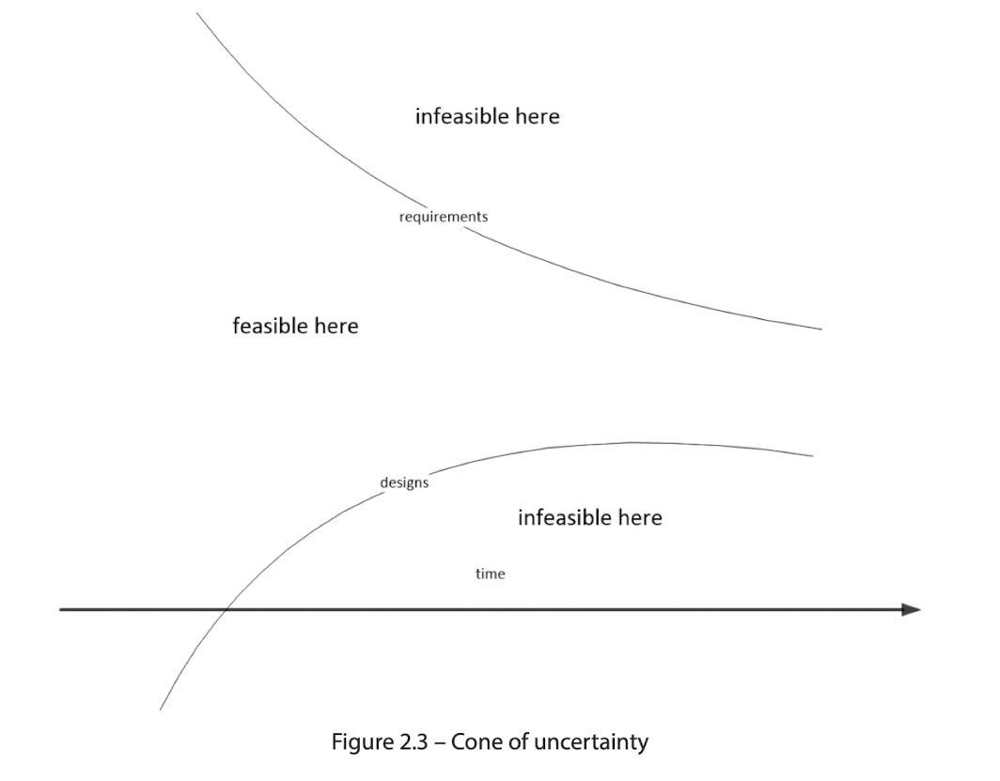

> [!info]
> SAFe là framework hàng đầu thế giới về Business Agility. SAFe tích hợp sức mạnh của [[refs/lean|Lean]], [[refs/agile|Agile]] và [[refs/DevOps|DevOps]] vào một hệ thống vận hành toàn diện giúp các doanh nghiệp phát triển mạnh mẽ trong thời đại kỹ thuật số bằng cách cung cấp các sản phẩm và dịch vụ sáng tạo nhanh hơn, có thể dự đoán được hơn và chất lượng cao hơn.

## Safe Core values
Safe có 4 giá trị cốt lõi, đến từ những practioner với ART và Lean Agile.
* Alignment: tất cả mọi người đều làm việc cùng nhau hướng đến mục tiêu (của một [[refs/ron_westrum_generative_culture|Generative Culture]]). Một ART có [[refs/ron_westrum_generative_culture|Generative Culture]]) sẽ có các team align với các team khác trong cùng 1 train.
* Transparency: một tổ chức [[refs/ron_westrum_generative_culture|Generative Culture]]) sẽ tự có sự minh bạch, điều này là một điểm quan trọng cho phép một tổ chức có thể align được và bồi dưỡng văn hoá sáng tạo.
* Program Execution: [[refs/ron_westrum_generative_culture|Generative Culture]] tập trung vào mục tiêu, và toàn bộ ART hoạt động minh bạch và cùng nhau làm việc hướng đến mục tiêu
* Built-in Quality: Defect và failure làm suy yếu khả năng của ART trong việc cung cấp giải pháp đáng tin cậy và duy trì tầm nhìn của ART. Cần có thái độ cảnh giác để duy trì chất lượng bằng cách phát hiện và loại bỏ các khiếm khuyết trong suốt quá trình phát triển để giữ cho ART đi đúng hướng.

# Safe Principles:

1. Taking an economic view
   1. Operating within Lean budgets and guardrails
   2. Understanding economic trade-offs
   3. Leveraging suppliers
   4. Sequencing jobs for maximum benefit: CoD, Weighted Shortest Job First
2. Apply systems thinking
3. Assuming variability and preserving options
  - Để điều hướng cone of uncertainty, tốt nhất là giữ cho các yêu cầu linh hoạt và có một số tùy chọn thiết kế (thường được gọi là set-based design (SBD)) có sẵn trong giai đoạn đầu.
  Trong quá trình triển khai, tổ chức sẽ tự học được requirement nào là không cần thiết và lựa chọn thiết kế nào là không khả thi.
  
4. Building incrementally with fast, integrated learning cycle
5. Basing milestones on an objective evaluation of working systems
  - Move from phase-gate milestone to the milestones based on feedback and learning  of each increment of value and of the integrated solution at that point in time.
6. Visualizing and limiting WIP, reducing batch sizes, and managing  queue lengths
7. Applying cadence – synchronizing with cross-domain planning
  - Bắt đầu với alignment, và chúng ta cần đảm bảo rằng mỗi người trong ART đều có tầm nhìn chung. Để đạt được điều đó, team trong ART đều cần apply [[refs/agile_cadence|cadence]] và synchronizing, cả 2 đều cần thiết để đảm bảo sự cân bằng giữa sự không chắc chắn vốn có trong quá trình phát triển và kế hoạch hiện tại của ART, cho phép có những thay đổi cần thiết.
    * Cadence: drumbeat of development.
    * Synchronizing: start/stop learning/development cycle at the sametime -> integrate entire system.
    * cross-domain planning: beginning of every [[refs/safe_pi|PI]]: all teams member align the ART mission for PI -> giảm thiểu biến số -> giảm rework.
8. Unlocking the intrinsic motivation of knowledge workers
  - After money,  what really motivated people were these things:
    * Autonomy: People want to have the freedom to explore the best solutions and self-direct the  work they want to do
    * Mastery: People want to improve their skills and build expertise
    * Purpose: People want validation that the work they do has meaning
9. Decentralizing decision-making:
  - SAFe recommends that these decisions to be escalated are like this
    * Infrequent: These decisions are not made often
    * Long-lasting: The impact of the decision will last for a long time
    * Incorporate significant economies of scale: The decision may affect the entire organization
  - Decentralized decisions are like this:
    * Frequent: These are common decisions that must be made often
    * Time-critical: These decisions have a high [[refs/don_reinertsen_cost_of_delay|CoD]]
    * Require local information: These decisions have information that is readily available to the  team in the environment
10. Organizing around value
  - Để tổ chức phù hợp với các nguyên tắc của SAFe và thúc đẩy văn hóa tạo động lực, điều quan trọng là phải tập trung vào việc cung cấp giá trị. Điều này bao gồm việc xem xét các yếu tố kinh tế và đảm bảo rằng cấu trúc giao tiếp phản ánh kiến trúc hệ thống. Bằng cách trao quyền cho các nhân viên tri thức đưa ra các quyết định chiến thuật, tổ chức có thể tăng tốc độ cung cấp giá trị.
  - Cấu trúc tổ chức nên phản ánh quy trình phát triển và giảm thiểu sự chuyển giao, làm việc trong các chu kỳ học tập nhỏ để duy trì luồng giá trị ổn định
  - Trong các tổ chức lớn, các bộ phận truyền thống cung cấp sự ổn định và hiệu quả theo quy mô. Tuy nhiên, SAFe giải quyết vấn đề này bằng cách xem luồng giá trị như một mạng lưới kết nối những người cần thiết để cung cấp giá trị nhanh chóng.
