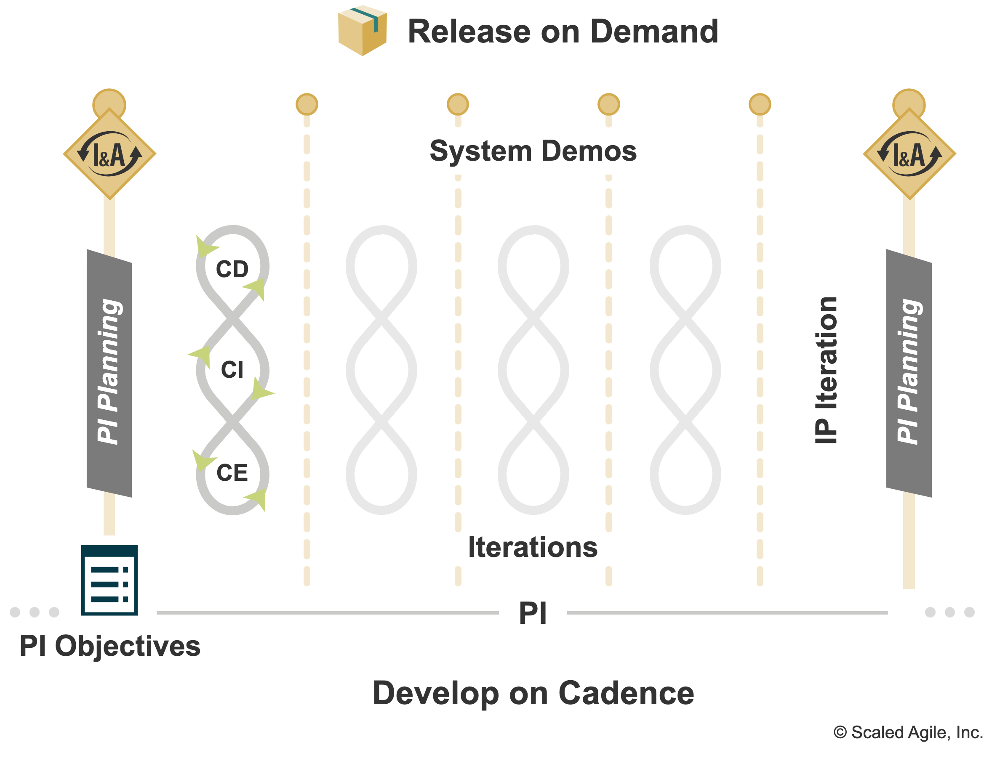

> [!info]
> là một khung thời gian cadence-based (refer to [[refs/agile_cadence|Cadence]]) trong đó ART mang lại giá trị liên tục cho khách hàng phù hợp với mục tiêu PI
> ở SAFe® 5 khái niệm này gọi là Program Increment

## Details

Một PI kéo dài khoảng 8-12 tuần.

## Develop on [[refs/agile_cadence|Cadence]]

Vì PI dựa trên [[refs/agile_cadence|Cadence]], thế nên nó dung cấp nhịp độ cho các tàu (ART) và các asset họ build: iteratively và incrementally, thực tế Develop on Candence là một nhóm các sự kiện và hoạt động hằng ngày hằng tuần trong development.

## References
* [ref 1](https://scaledagileframework.com/planning-interval/)