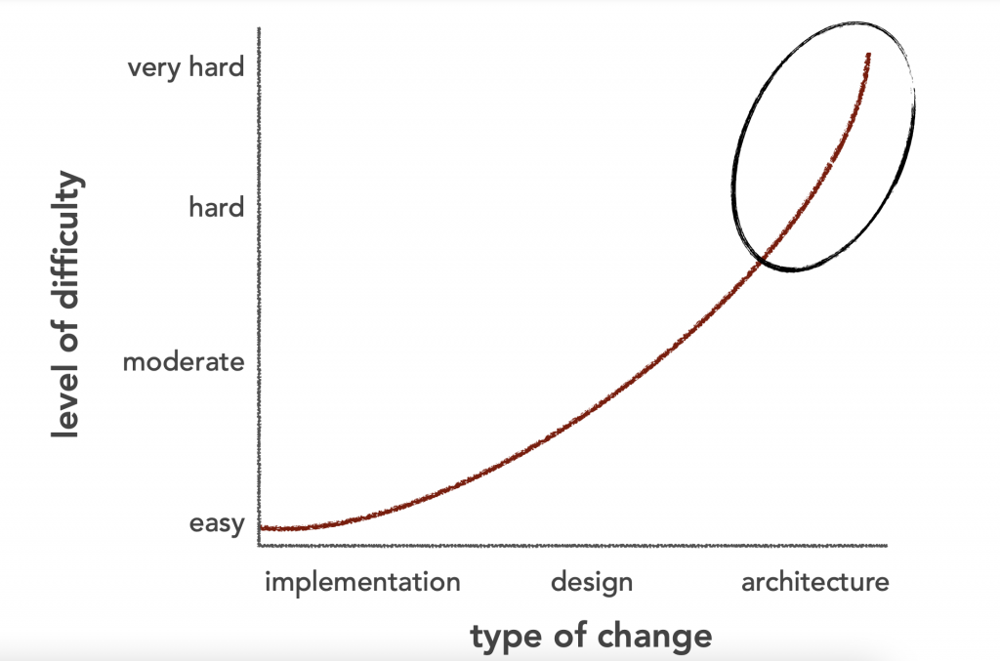

Như ở phần [[writing/Software-Architecture-Origin/software-arch-bat-dau-tu-dau-1|trước]] mình đã nói về các Soft Skills mà mình cho là yếu tố khác biệt giữa
Developer và Software Architecture.

Decision
=====

Về cơ bản thì với vai trò là Software Architecture bạn sẽ cần quyết định nhiều thứ.

**Đầu tiên hãy kể đến chính Kiến trúc, thứ mà bạn đang xây dựng.**

Nếu bạn có vài trò là người quyết định kiến trúc, bạn gần như sẽ là người đảm bảo duy nhất cho sự toàn vẹn của hệ
thống, về mặt khái niệm thôi nhé. Tức là bạn sẽ là người đầu tiên hình dung ra hình dáng của hệ thống và thông thường
những quyết định kiểu này sẽ được đặt ra trong những phase đầu tiên của phần mềm.

> Nhiều người sẽ thắc mắc nếu quyết định đó là sai, thực tế thì những quyết định bởi những người có kinh nghiệm sẽ
> thường ***phù hợp*** với tình hình ở thời điểm đó.

> Một câu hỏi khác: tại sao chỉ một người đảm bảo duy nhất cho sự toàn vẹn? Thông thường ở một mức độ nào đó, trong một
> đội dự án, Architect sẽ có sự hiểu biết tốt nhất về hệ thống cũng như các hard skill khác, và họ sẽ có một cách hình
> dung khá chung với những người có trình độ tương đương. Tuy nhiên việc này sẽ dẫn tới việc nghẽn cổ chai ở Architect,
> vậy nên việc này sẽ dẫn tới một khái niệm khác là Architectural Knowledge Management hay Software Architecture Knowledge
> Management (điều này giải thích tại sao các team thường có wiki hay những bản tài liệu được chia sẻ về kiến
> thức) [Read more](https://archixl.nl/files/2009-Springer-AKStateOfTheArt.pdf)

Vậy thực sự có thể nói họ sẽ làm những việc như này

* Thiết kế kiến trúc
* Định ra các nguyên tắc để quyết định về mặt công nghệ.

> Ví dụ:
> Bạn sẽ cần đưa ra quyết định về việc sử dụng API Gateway để làm một endpoint duy nhất cho cả mobile và web hay sẽ sử
> dụng Backend for Frontend trong mô hình microservice.

Ồ thì dẫn đến một điều bạn cứ trả lời 2 câu hỏi dưới đây bạn sẽ biết là bạn có đang *đưa ra* các quyết định về mặt kiến
trúc hay không:

* Mức độ ảnh hưởng có ở toàn hệ thống hay không? Độ khó để implement quyết định đó?
* Quyết định đó có giúp team quyết định về mặt công nghệ hoặc chỉ định cho họ.

Một công việc hằng ngày bạn có thể thấy mấy tên Architect hay làm đó là ngồi tìm hiểu thực sự bạn đang làm gì trong dự
án, bạn có hiểu vấn đề chung của dự án hay không, tìm các vấn đề quan trọng và giải quyết trước khi mọi thứ trở nên tồi
tệ (chỗ này định ghi là một bãi rác).

> Trong một dự án IoT gần đây mình có tham gia, Architect của dự án đã quyết định cho team backend dừng công việc để
> chỉnh trang lại kiến thức chung.

> Hoặc đơn giản hơn, Architect có thể ngồi với developer để tìm ra một số đoạn code gây lock hệ thống, buổi chiều có thể
> sharing với dự án về những thứ khá phi kỹ thuật như việc những đoạn code của họ sẽ gây ảnh hưởng đến chi phí AWS.

> Bạn có thể thấy rằng việc bạn không thể hình dung dự án đang làm ra sản phẩm như nào rất nguy hiểm, giả như rằng bạn
> khăng khăng bạn sẽ phải code lại toàn bộ luồng OAuth2.0 cho toàn bộ các microservice để dùng chung một endpoint, nhưng
> thực tế là hoàn toàn bạn có thể để chúng riêng rẽ, điều quan tâm duy nhất là dùng chung Identity Pool, việc làm đó có
> thể khiến những team khác trong dự án bị trễ lịch đến hàng tuần.

Tính đúng đắn của quyết định — Justifying decisions
-----

Rõ ràng quyết định đã được đưa ra, điều đó là tất yếu trong hoàn cảnh đồng hồ của dự án bắt đầu tính giờ.
Tuy nhiên thì không phải quyết định nào cũng được chấp nhận (chỉ là được chấp nhận nhé, chưa bàn đến tính đúng sai)

Hãy quay trở lại ví dụ bên trên về API Gateway và Backend for Frontend, đây thực chất là kết quả sau khi Architect đã
xem xét rõ ràng (đúng hoặc sai), còn quá trình thì sao.

Để bất đầu hãy xem xét **kịch bản** tại sao lại có sự lựa chọn:
> Giả sử bạn đang xây dựng một cửa hàng trực tuyến sử dụng Microservice và bạn đang triển khai trang
***product detail***. Bạn cần phát triển nhiều phiên bản của giao diện người dùng chi tiết sản phẩm: cho cả web browser
> dưới dạng HTML5 hoặc Rest API để phục vụ cho mobile.
>
>  Giao diện này cần có nhiều thông tin: thông tin về sản phẩm, số lượng, lịch sử mua, các tùy chọn mua, các sản phẩm
> thường được mua cùng (một dang recommendation), review, rating của người bạn...
>
>  Và chúng ta có các service sau:
>  * Product Info Service
>  * Pricing Service
>  * Order service
>  * Inventory service
>  * Review service
>  * Recommendation service
     > **Như vậy trang product detail cần tất cả các service trên**

**Bài toán** được đặt ra là:
> Làm cách nào để client của một ứng dụng Microservices truy cập vào các dịch vụ riêng lẻ?

**Quyết định**

#### Api Gateway

Sử dụng API Gateway là entrypoint duy nhất cho tất cả các client. API Gateway xử lý các yêu cầu theo một trong hai cách.

* Một số yêu cầu chỉ đơn giản là proxied/routed đến service thích hợp.
* Hoặc thay vì cùng cấp API kiểu one-size-fits-all, API Gateway cung cấp các API khác nhau cho từng client.
  

#### Backend For Frontend

BFF tạo ra các Gateway riêng rẽ cho từng loại Client.

### Các điều kiện và ràng buộc (Conditions and Contraints)

Có nhiều yếu tô cần tính tới trong trường hợp này, nhưng mình sẽ tạm thời bỏ qua những vấn đề mang tính chủ quan của một
dự án phần mềm: Con người (mặt bằng chung của team, broken comb, T-Shaped, ...), process, stakeholder (rất nhiều khách
hàng can thiệp vào architecture), mặc dù trên thực tế Architect thường nắm vai trò Technical Lead luôn nên sẽ cần cân
nhắc. Hãy đi vào vấn đề kỹ thuật thôi.

* Thường thì API do microservices cung cấp thường khác với những gì Client cần, về chi tiết nhé. Microservices thường
  cung cấp các API chi tiết, có nghĩa là client sẽ cần tương tác với nhiều service. Ví dụ, như được mô tả ở trên, client
  cần thông tin chi tiết về sản phẩm và cần tới nhiều dịch vụ.
* Các Client khác nhau sẽ cần dữ liệu khác nhau. Ví dụ phần Recommendation cho phiên bản web sẽ nhiều hơn và có nhiều
  hành động hơn phiên bản API cho Mobile.
* Đường truyền điện thoại với 3G, 4G sẽ khác với các trình duyệt ở trên máy tính được kế nối qua cáp quang cả về băng
  thông lẫn tính ổn định, thậm chí là chi phí. Có nghĩa là chúng ta có thể tăng số lượng request từ phía trình duyệt mà
  không ảnh hưởng quá nhiều đến trải nghiệm của người dùng lẫn chi phí băng thông, ngược lại với ứng dụng mobile.
* Số lượng phiên bản của service và thông tin *(host:port)* thay đổi động
* Việc thay đổi các phiên bản của service (upgrade, canary) không nên transparent với client
* Một số dịch vụ được integration và sử dụng gRPC, webservice hoặc SOAP không thân thiện lắm với các client hiện nay.

### Cân nhắc — Consideration

Với API Gatway chúng ta sẽ có một API thân thiện với client với protocol tiêu chuẩn. Việc triển khai Client sẽ đơn giản
hơn vì logic của việc xử lý nhiều service sẽ nằm ở Gateway thay vì client.
Tuy nhiên dánh đổi bằng việc tăng độ phức tạp — API Gateway là một phần khác phải được phát triển, triển khai và quản
lý, ngoài ra thời giản xử lý request cũng tăng lên vì thêm có bước xử lý network hop ở Gateway, tuy nhiên vân ngắn hơn
thời gian xử lý cho BFF.

### Quyết định về kiến trúc — Architecture decision

***API Gateway***

### Biện luận

API Gatway với Spring có thể sử dụng Netflix Zuul, việc sử dụng Gateway sẽ đem đến trải nghiệm người dùng tốt hơn, vấn
đề effort cho develop, deploy có thể giảm bằng cách đồng nhất cách thức xử lý cho các service sẽ đc xây dựng (dùng cùng
một tech-stack)

## Tài liệu hóa và trao đổi về quyết định về kiến trúc

### Trao đổi về kiến trúc (giữa Architect và Developer)

Trong dự án phần mềm của bạn có các kênh trao đổi nào?

#### Email

Email (đơn thuần là email) thực tế không thích hợp để trao đổi nhất là về mặt kỹ thuật, có quá nhiều vấn đề trong quá
trình xây dựng kiến trúc và thông tin trong email khá khó để tổng hợp và truyền đạt lại, hãy nghĩ đến việc bạn sẽ cho
một thành viên mới dành cả 2 tuần lễ để đọc lại thread mail.

#### Hãy document quyết định về kiến trúc

Sử dụng wiki là một biện pháp ổn, nhanh, giao diện đẹp, dễ viết với Markdown và quan trọng nhất là tập trung. Một vấn đề
nữa, hãy chỉ rõ hoặc quyết định luôn chỗ mà quyết định được lưu trữ (hơi nhiều từ quyết định, tho)

Với các vấn đề quan trọng và ảnh hưởng lớn, hãy đảm bảo tất cả mọi người cần biết được biết về nó. Bảng trắng luôn là
một lựa chọn tốt để trao đổi, nếu trong thời buổi WFH có thể sử dụng các công cụ trong kênh giao tiếp.

P/S: hãy ra quyết định một cách khôn ngoan nhé.

Happy Coding.