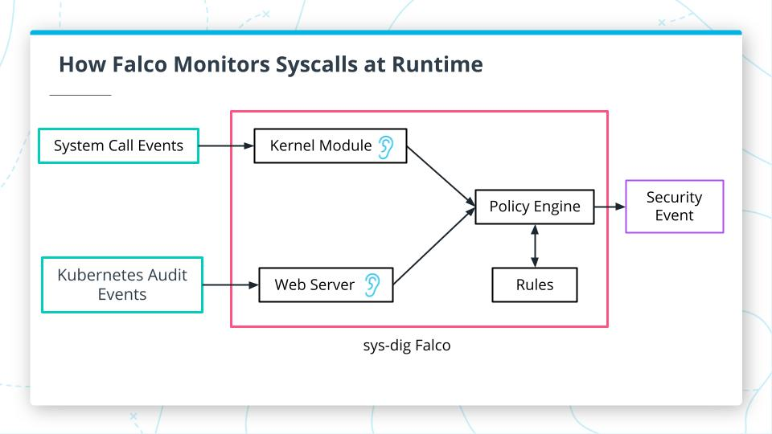
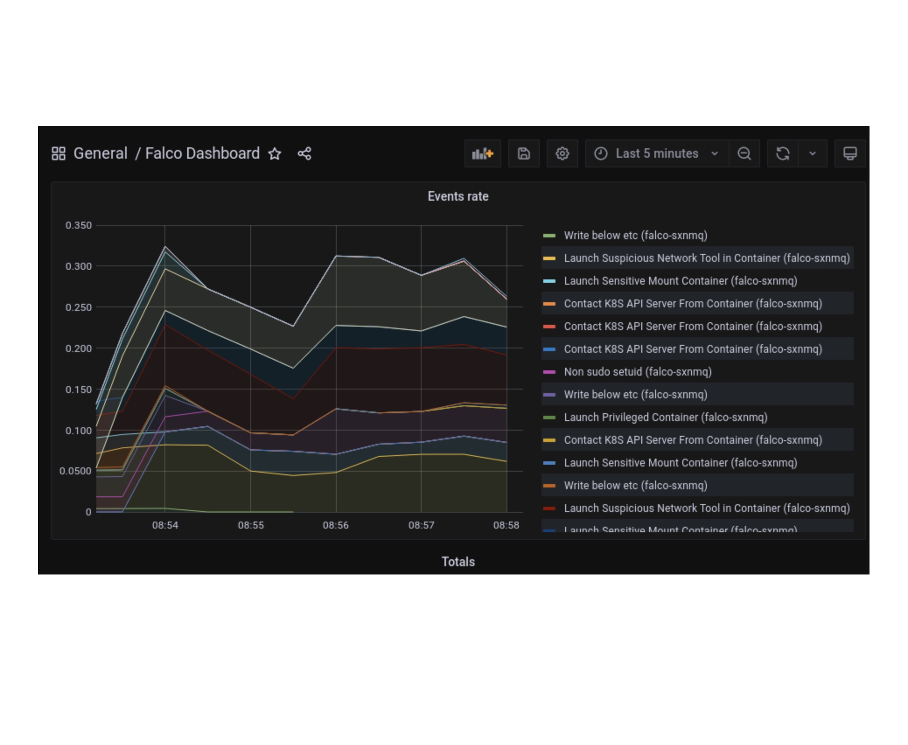

# Tại sao cần Monitor Container@runtime?

Tất cả các kiểm soát bảo mật mà chúng ta đã làm việc cho đến nay đều tập trung vào trước khi triển khai (predeploy),
điều này không
đủ để xác định các vấn đề với microservices đang chạy. Với những gì chúng ta đã triển khai cho đến nay, bạn sẽ không thể
phát hiện sự xâm phạm vào service trong môi trường của mình.

Process monitoring@runtime là rất quan trọng để phát hiện các quá trình đáng ngờ đang chạy trên pod của bạn trong
cluster
Kubernetes. Các quá trình là động và có thời hạn. Giám sát khi chạy cho phép phát hiện mối đe dọa theo thời gian thực.
Đây là cách hợp pháp duy nhất để phát hiện sự xâm phạm dịch vụ trong môi trường production container đang chạy. Với điều
này, chúng ta sẽ có thể phản ứng với các sự cố bảo mật nhanh hơn, yếu tố thời gain là tối quan trọng

Bất kể nỗ lực kiểm soát phòng ngừa trước khi triển khai của chúng ta có tốt như thế nào, chúng ta vẫn sẽ bị tấn công.
Điều tốt nhất chúng
ta có thể làm là có công cụ và quy trình để phản ứng với các sự cố bảo mật không thể tránh khỏi.

Monitor@runtime là tuyến phòng thủ cuối cùng để phát hiện một cuộc tấn công. Trọng tâm là nhanh chóng nhận được context
cho một sự kiện đáng ngờ và hành động trước khi quá muộn.

# Vậy cụ thể nó là gì?

Container monitoring@runtime cho phép bạn thấy mọi yêu cầu hoặc tương tác mà kernel xử lý. Chúng ta sau đó kiểm tra
những tương tác này bằng cách đối chiếu với các quy tắc đã được định nghĩa tước, qua đó chúng ta phát hiện các sự kiện
có thể đáng ngờ.

Từ đó, các sự kiện đáng ngờ nên được điều tra để xác định xem chúng vô hại hay có thể nguy hiểm, điều này có thể yêu cầu
điều tra thêm hoặc thậm chí tạo ra một sự cố bảo mật.

Container monitoring@runtime bằng cách sử dụng các [system call](system_call). Hãy xem xét kỹ hơn cách
các [system call](system_call) hoạt
động.

Hãy quay lại các [container](container), mỗi khi bạn mở một tệp, thiết lập một kết nối mạng,
hoặc khởi động một quá trình, [container](container) sẽ thực hiện một [system call](system_call) sử dụng một isolated
namespace đến kernel.
Tất cả các sự kiện này đều liên quan đến bảo mật, và chúng nên được monitored@run-time.

# Vậy [Falco](falco.md) Monitor Syscalls@Runtime như nào?

Kiểm tra các [system call](system_call) có thể được thực hiện qua mô-đun kernel, lắng nghe các sự kiện [system call](system_call).

Để có được bối cảnh về những gì đang diễn ra giữa các pod và node, chúng ta cũng cần thu thập các sự kiện để audit
Kubernetes. Ví dụ, khi Kubernetes tạo hoặc xoá các [pod](pod), [service](service), hoặc [deployment](deployment), và khi Kubernetes tạo, cập nhật, và
xoá ConfigMaps hoặc Secrets. Một server có thể lắng nghe và kiểm kê các sự kiện đó. Một bộ quy tắc sẽ được sử dụng để kiểm
tra. Đây chính xác là những gì Sysdig Falco làm cho chúng ta. Sơ đồ dưới đây cho thấy cách các thành phần này hoạt động cùng nhau để tạo ra các sự kiện bảo mật:

Cuối cùng chúng ta có thể integrate với một hệ thống giám sát trực quan như [Grafana](grafana) để hoàn thiện một setup [DevSecOps](devsecops)

Thực tế, nhiều người đã cài 1 số pod đào coin vào các cluster k8s và đã bị phát hiện như [này](https://falco.org/blog/falco-detect-cryptomining/)