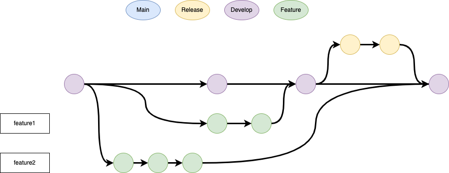
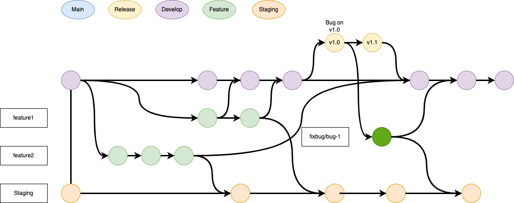

How to use Git
================

Lập trình viên sử dụng Git hằng ngày, tuy nhiên phần lớn mọi người vẫn đang sử dụng các câu lệnh cơ bản như commit, push, pull; và khi cần là người tham gia hoặc bắt đầu vào việc quản lý repository và các Version Release thì bắt đầu lúng túng.
Sau đây mình mong muốn chia sẻ một số câu chuyện trong công ty mà mình đã gặp phải.

Case 1: Chọn feature release.
----------------

Một dự án làm kết hợp cả mobile và backend, khách hàng có thể yêu cầu rất nhiều feature trong Sprint hay một giai đoạn của dự án. Tuy nhiên, từ nhu cầu từ phòng marketing có thể nhiều feature sẽ không được chọn để golive, thế nhưng Test team vẫn cần một phiên bản với đầy đủ các tính năng để hoàn thiện task.

Từ đầu dự án, trong một thời gian khá dài, dự án sử dụng release branch workflow, tất nhiên do tình hình ban đầu của dự án lúc đó, chỉ cần chuyển toàn bộ tính năng từ môi trường ***develop*** đến ***staging*** rồi đến ***production***.

Khi khách hảng nảy sinh nhu cầu kể trên, sai lầm đã xảy ra, developer đã cố gắng sử dụng cherry-pick để chọn các commit từ nhánh staging sang production, dễ nhận thấy là có khả năng rất lớn commit sẽ bị lack.

### Vậy team đã làm như nào

Dễ thấy nhu cầu ở đây là duy trì source code giữa các feature/task/fixbug độc lập với nhau. Bên cạnh đó những nhánh này vẫn merge về nhánh develop dành cho việc verify feature và duy trì latest live version.

Để cho dễ hiểu, chúng ta vẫn code trên nhánh feature như bình thường và merge tuy nhiên source code ở feature khi đó hoàn thiện hơn (sau khi tester đã kiểm thử) và merge khi feature hay bug đó (bug này là bug được phát hiện ở production) được quyết định release, tạm gọi nhánh này là nhánh ***staging***
Trước đó phiên bản mà tester nhận được để verify feature hay bug sẽ được merge thường xuyên hơn giống như nhánh develop như ở git flow cũ. (tạm gọi là ***develop***)

Chúng ta đi giải quyết các câu hỏi tiếp theo gắn liền với các hoạt động trong team hằng ngày.

#### Tính năng mới

Gần như không có sự khác biệt với cách làm cũ

#### Fix bug

Vậy bug được xử lý như nào. Nguyên tắc đưa ra cũng rất đơn giản, nhưng implement thì phức tạp hơn chút.
* Bug ở đâu sẽ được fix ở đó. Tức là khi bạn phát hiện bug ở đâu thì sẽ được fix ở đó trước: ví dụ ở trên golived version hay develop hay staging
* Xác định nguồn gốc của bug
  * Tốt nhất bạn nên xác định được bug được tạo ra từ commit nào hoặc lúc team đang làm một thứ gì đó.
  * Nếu không thể xác định được (có thể do có nhiều nguyên nhân dẫn đến bug) thì có thể xác định được feature hoặc khi fix bug nào đó mà dẫn đến degrade.
* Sau khi xác định được 2 điểm bên trên và vá xong bug ở nhánh chúng ta phát hiện (tách nhánh fix bug và merge)
  * Cherry-pick/merge merge commit về các nhánh liên quan:
    * Ví dụ bạn phát hiện bug ở phiên bản 2.0.1, tuy nhiên bản 2.0 và 1.0 là 2 phiên bản chạy song song (1.0 vẫn là LTS) mà bạn xác định được bug xuất hiện từ 1.0 thì vẫn phải vá cho 1.0, tuy nhiên trong trường hợp này đôi khi chúng ta thường coi nó là 2 bug cho dễ xử lý
    * Trường hợp phổ biến hơn là bug ở staging (nhánh cho tester), vì ***staging*** không được merge với ***develop*** nên chúng ta cần cherry-pick/merge về ***develop*** và nhánh implement feature đó, với nhánh ***develop*** chúng ta có thể sử dụng ***merge*** do ***develop*** luôn chứa latest source code
    * Nếu feature đã được release ở golived version thì chỉ cần quan tâm đến ***develop***, ***staging*** là ổn, nhưng thực ra trước đó nhánh fix bug cũng được implement như trên hình thứ 3 rồi.

Như vậy đơn giản có thể tóm lược lại như sau: khi bug được phát hiện thì fix ngay ở đó và cherry-pick/merge về các nhánh liên quan mà chưa được release: ***staging***, ***develop*** là require.

#### Release

Khá đơn giản, khi source code đã được kiểm thử ở ***staging*** và cherry-pick/merge các bản vá về nhánh ***feature*** và fixbug thì có nghĩa là source code ở các nhánh đó được hoàn thiện và sẵn sàng để release, khi cần chức năng nào hoàn toàn có thể merge vào nhánh ***production*** hoặc cẩn thận hơn có thể đưa thêm nhánh ***pre-production*** vào sử dụng để user có thể kiểm tra lại lần cuối.
