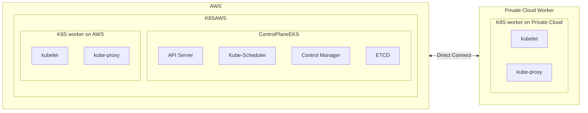

Although, we consider that k8s in particular and compute in general is quite the simplest part when implementing a multi-cloud, multi-datacenter approach, but we still have several things we have to make decisions.

A cluster consists of three main planes:

- **Control plane:** The control brain is considered the brain of the Kubernetes cluster that consists of a few core components, including the API server, the Control Manager, and the Scheduler.
- **Data plane:** The data plane is the storage of a cluster and is usually implemented through a highly available etcd database.
- **Worker plane:** You can consider the worker plane as the muscle that runs the actual workloads in a cluster and consists of nodes that contain pods.

We have several options:
# 1. Multi cluster, starts with a global load balancer ([GSLB](https://www.cloudflare.com/learning/cdn/glossary/global-server-load-balancing-gslb/))
Reference to: https://traefik.io/glossary/understanding-multi-cluster-kubernetes/

We start from a single simple K8S cluster
![[k8s-traefik.png]]
The idea of multi-cluster architecture are create new cluster in another data centers/cloud provider/...

![[k8s-multi-traefik.png]]

## How we setup cluster
The problem here is how we approach it segmentation (segmenting the service on k8s and put it in designated cluster)vs. replication (simply replicate everything)

With segmentation, we have to start from categorize the service and workload on k8s then choose the cluster for it.
With replication, we have to setup an inter-cluster virtual network across multi cluster, and maintain the communication between all of our K8s clusters through a network (VPN, direct connect, ...)

### Tool for setup and require

#### IAC
#### Managed Kubernetes Services
	
* KubeFed
#### Service Mesh
* Calico
### Problem: Inter-cluster connectivity/Service discovery/Load Balancing/ 
* Tigera calico: eBGP based on ip-tunnel
- SIG Multicluster: https://multicluster.sigs.k8s.io/concepts/multicluster-services-api/
- Skupper: provide Virtual Application Network (VAN) https://skupper.io/
	- Provide connectivity across the hybrid cloud at L7
	- Suitable for multiple setup: Edge-to-edge, Secure hybrid cloud communication

# 2. Single cluster, use control plane from EKES and join worker node from on-premise/

This setup will try to use EKS control plane with high availability, However, we have multiple  node groups from multiple cloud providers with specific metadata for manual zone/cloud/data center assignment for pod.

Nonetheless, we need to think more about shared storage and the cluster network (CNI) at an even higher level.

Components:
- Pod Networking (CNI: Calico, Weave, etc.)
- Secure Communication (TLS, IAM, RBAC)
- Shared Storage (EBS, NFS, etc.)
- Centralized Monitoring & Logging

### PoC plan

1. Create an EKES in a PC on AWS
2. Create vpn connection, config vpn connection
3. Add local node to EKS
4. Setup calico network
5. Setup storage class
6. Use node selectors or taints and tolerations to schedule workloads on specific nodes (AWS or private cloud).

