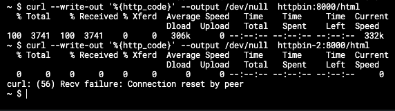
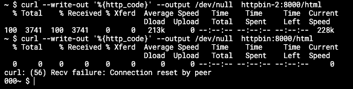

## Install Calico.
```
helm repo add projectcalico https://docs.tigera.io/calico/charts

kubectl create namespace tigera-operator

helm install calico projectcalico/tigera-operator --version v3.28.1 --namespace tigera-operator
```

Wait for calico installed

## Install Istio ambient

[[Ambient Overview|https://istio.io/latest/docs/ambient/overview/]]

### Optional install Kiali

Set data plane mode ambient to namespace
```
 kubectl label namespace default istio.io/dataplane-mode=ambient
```

## Demo

Create 2 httpbin service as target
```
apiVersion: v1
kind: ServiceAccount
metadata:
  name: httpbin
---
apiVersion: v1
kind: Service
metadata:
  name: httpbin
  labels:
    app: httpbin
    service: httpbin
spec:
  ports:
    - name: http
      port: 8000
      targetPort: 8080
  selector:
    app: httpbin
---
apiVersion: v1
kind: ServiceAccount
metadata:
  name: httpbin-2
---
apiVersion: v1
kind: Service
metadata:
  name: httpbin-2
  labels:
    app: httpbin-2
    service: httpbin-2
spec:
  ports:
    - name: http
      port: 8000
      targetPort: 8080
  selector:
    app: httpbin-2
---
apiVersion: apps/v1
kind: Deployment
metadata:
  name: httpbin
spec:
  replicas: 1
  selector:
    matchLabels:
      app: httpbin
      version: v1
  template:
    metadata:
      labels:
        app: httpbin
        version: v1
    spec:
      serviceAccountName: httpbin
      containers:
        - image: docker.io/kong/httpbin
          imagePullPolicy: IfNotPresent
          name: httpbin
          # Same as found in Dockerfile's CMD but using an unprivileged port
          command:
            - gunicorn
            - -b
            - "[::]:8080"
            - httpbin:app
            - -k
            - gevent
          env:
            # Tells pipenv to use a writable directory instead of $HOME
            - name: WORKON_HOME
              value: /tmp
          ports:
            - containerPort: 8080
---
apiVersion: apps/v1
kind: Deployment
metadata:
  name: httpbin-2
spec:
  replicas: 1
  selector:
    matchLabels:
      app: httpbin-2
      version: v1
  template:
    metadata:
      labels:
        app: httpbin-2
        version: v1
    spec:
      serviceAccountName: httpbin-2
      containers:
        - image: docker.io/kong/httpbin
          imagePullPolicy: IfNotPresent
          name: httpbin
          # Same as found in Dockerfile's CMD but using an unprivileged port
          command:
            - gunicorn
            - -b
            - "[::]:8080"
            - httpbin:app
            - -k
            - gevent
          env:
            # Tells pipenv to use a writable directory instead of $HOME
            - name: WORKON_HOME
              value: /tmp
          ports:
            - containerPort: 8080
```

Create sleep service as requester

```
# Copyright Istio Authors
#
#   Licensed under the Apache License, Version 2.0 (the "License");
#   you may not use this file except in compliance with the License.
#   You may obtain a copy of the License at
#
#       http://www.apache.org/licenses/LICENSE-2.0
#
#   Unless required by applicable law or agreed to in writing, software
#   distributed under the License is distributed on an "AS IS" BASIS,
#   WITHOUT WARRANTIES OR CONDITIONS OF ANY KIND, either express or implied.
#   See the License for the specific language governing permissions and
#   limitations under the License.

##################################################################################################
# Sleep service
##################################################################################################
apiVersion: v1
kind: ServiceAccount
metadata:
  name: sleep
---
apiVersion: v1
kind: Service
metadata:
  name: sleep
  labels:
    app: sleep
    service: sleep
spec:
  ports:
    - port: 80
      name: http
  selector:
    app: sleep
---
apiVersion: apps/v1
kind: Deployment
metadata:
  name: sleep
spec:
  replicas: 1
  selector:
    matchLabels:
      app: sleep
  template:
    metadata:
      labels:
        app: sleep
    spec:
      terminationGracePeriodSeconds: 0
      serviceAccountName: sleep
      containers:
        - name: sleep
          image: curlimages/curl
          command: ["/bin/sleep", "infinity"]
          imagePullPolicy: IfNotPresent
          volumeMounts:
            - mountPath: /etc/sleep/tls
              name: secret-volume
      volumes:
        - name: secret-volume
          secret:
            secretName: sleep-secret
            optional: true
---
apiVersion: v1
kind: ServiceAccount
metadata:
  name: sleep-2
---
apiVersion: v1
kind: Service
metadata:
  name: sleep-2
  labels:
    app: sleep-2
    service: sleep-2
spec:
  ports:
    - port: 80
      name: http
  selector:
    app: sleep-2
---
apiVersion: apps/v1
kind: Deployment
metadata:
  name: sleep-2
spec:
  replicas: 1
  selector:
    matchLabels:
      app: sleep-2
  template:
    metadata:
      labels:
        app: sleep-2
    spec:
      terminationGracePeriodSeconds: 0
      serviceAccountName: sleep-2
      containers:
        - name: sleep
          image: curlimages/curl
          command: ["/bin/sleep", "infinity"]
          imagePullPolicy: IfNotPresent
          volumeMounts:
            - mountPath: /etc/sleep/tls
              name: secret-volume
      volumes:
        - name: secret-volume
          secret:
            secretName: sleep-secret
            optional: true
---
```

Apply **AuthorizationPolicy** for ALLOW and DENY traffic from `sleep`

```
apiVersion: security.istio.io/v1
kind: AuthorizationPolicy
metadata:
  name: allow-sleep-to-httpbin-2
spec:
  selector:
    matchLabels:
      app: httpbin-2
  action: ALLOW
  rules:
    - from:
        - source:
            principals:
              - cluster.local/ns/default/sa/sleep-2
---
apiVersion: security.istio.io/v1
kind: AuthorizationPolicy
metadata:
  name: allow-sleep-to-httpbin
spec:
  selector:
    matchLabels:
      app: httpbin
  action: ALLOW
  rules:
    - from:
        - source:
            principals:
              - cluster.local/ns/default/sa/sleep
---
```

Output

On `sleep`: allow connect to `httpbin`



On `sleep-2`: allow connect to `httpbin-2`



## TODO
[] implement Waypoint proxies to reach zero trust network